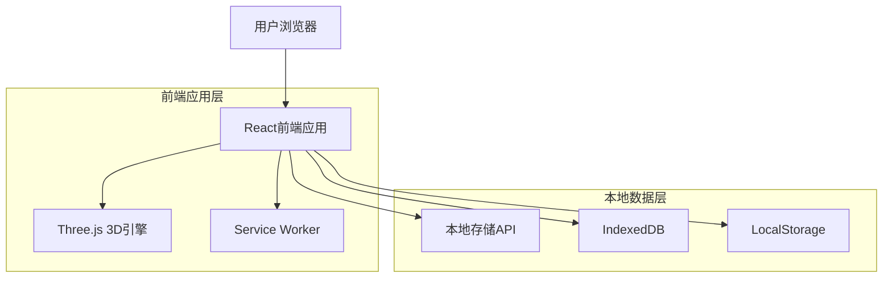

## 1. 架构设计
采用纯前端架构，无需后端服务器，所有功能在浏览器本地运行。



## 2. 技术描述
- **前端框架**：React@18 + Vite@4（构建工具）
- **3D渲染**：Three.js@0.155（3D图形库）
- **UI组件**：React Bootstrap@2或Material-UI@5
- **数学公式**：KaTeX@0.16（LaTeX公式渲染）
- **本地存储**：浏览器IndexedDB + LocalStorage
- **部署方案**：GitHub Pages（免费静态托管）
- **开发环境**：Node.js@18 + npm@9

## 3. 路由定义
| 路由 | 用途 |
|-------|---------|
| / | 首页，几何体分类导航 |
| /geometry/:type | 3D展示页，显示指定类型的几何体 |
| /learn/:type | 学习页，显示几何体的理论知识 |
| /progress | 进度页，学习记录和统计 |
| /offline | 离线提示页，无网络时显示 |

## 4. 本地数据存储方案

### 4.1 IndexedDB存储结构
```javascript
// 学习进度数据
interface LearningProgress {
  id: string;           // 几何体类型ID
  type: string;         // 几何体名称
  visitCount: number;   // 访问次数
  lastVisit: Date;      // 最后访问时间
  practiceScore: number; // 练习得分
  masteryLevel: number;  // 掌握程度(0-100)
}

// 练习记录
interface PracticeRecord {
  id: string;
  geometryType: string; // 几何体类型
  question: string;      // 题目内容
  answer: number;        // 正确答案
  userAnswer: number;    // 用户答案
  isCorrect: boolean;    // 是否正确
  timestamp: Date;       // 答题时间
}
```

### 4.2 LocalStorage存储
```javascript
// 应用配置
interface AppConfig {
  theme: 'light' | 'dark';      // 主题设置
  language: 'zh-CN';            // 语言设置
  autoRotate: boolean;          // 3D模型自动旋转
  showGrid: boolean;            // 显示网格
  version: string;              // 应用版本
}

// 临时数据
interface TempData {
  currentGeometry: string;      // 当前几何体类型
  lastPage: string;             // 最后访问页面
  sessionStartTime: Date;       // 会话开始时间
}
```

## 5. 3D几何体实现方案

### 5.1 基础几何体类型
```javascript
// 几何体配置接口
interface GeometryConfig {
  type: string;                 // 几何体类型
  name: string;                 // 显示名称
  threeJsGeometry: Function;    // Three.js几何体构造函数
  defaultParams: object;        // 默认参数
  formula: {                     // 计算公式
    surfaceArea: string;         // 表面积公式
    volume: string;             // 体积公式
  };
  properties: string[];         // 几何性质列表
}
```

### 5.2 支持的几何体
- **立方体**（BoxGeometry）
- **球体**（SphereGeometry）
- **圆柱体**（CylinderGeometry）
- **圆锥体**（ConeGeometry）
- **圆环体**（TorusGeometry）
- **四面体**（TetrahedronGeometry）

## 6. 离线缓存策略

### 6.1 Service Worker配置
```javascript
// 缓存策略
const CACHE_NAME = 'geometry-app-v1';
const urlsToCache = [
  '/',                    // 首页
  '/static/js/bundle.js', // JS文件
  '/static/css/main.css', // CSS文件
  '/models/',             // 3D模型数据
  '/icons/'               // 图标资源
];

// 网络优先策略
const networkFirst = new NetworkFirst({
  cacheName: 'geometry-dynamic',
  networkTimeoutSeconds: 3,
});
```

### 6.2 资源清单
- 应用壳（App Shell）：HTML、CSS、JS文件
- 3D模型数据：几何体参数和材质
- 图标资源：UI图标和几何体缩略图
- 学习内容：公式、性质、练习题

## 7. 本地构建和部署

### 7.1 开发环境搭建
```bash
# 克隆项目
git clone https://github.com/your-username/geometry-app.git
cd geometry-app

# 安装依赖
npm install

# 启动开发服务器
npm run dev

# 构建生产版本
npm run build
```

### 7.2 GitHub Pages部署
```bash
# 构建并部署到GitHub Pages
npm run deploy

# 或使用GitHub Actions自动部署
# .github/workflows/deploy.yml
```

### 7.3 本地运行选项
- **静态服务器**：使用`serve`包本地运行
- **PWA安装**：作为渐进式Web应用安装到桌面
- **离线包**：下载完整zip包，解压后离线使用