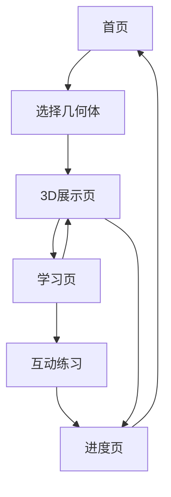

## 1. 产品概述
立体几何教学应用是一款面向学生的本地3D几何学习工具，无需服务器即可运行。
- 解决学生立体几何学习困难，提供直观3D模型展示
- 支持离线使用，学习进度本地保存，即开即用无需注册

## 2. 核心功能

### 2.1 用户角色
| 角色 | 使用方式 | 核心权限 |
|------|----------|----------|
| 学生用户 | 直接打开使用 | 浏览3D模型、学习几何知识、保存学习进度 |

### 2.2 功能模块
应用包含以下核心页面：
1. **首页**：几何体分类导航、学习进度概览
2. **3D展示页**：3D模型旋转缩放、几何属性展示
3. **学习页**：几何公式、性质说明、互动练习
4. **进度页**：学习记录、掌握程度统计

### 2.3 页面详情
| 页面名称 | 模块名称 | 功能描述 |
|-----------|-------------|---------------------|
| 首页 | 几何体分类 | 展示基础几何体（立方体、球体、圆柱体等）分类卡片 |
| 首页 | 学习进度 | 显示总体学习进度百分比、最近学习内容 |
| 3D展示页 | 3D模型视图 | 支持鼠标拖拽旋转、滚轮缩放、双击重置视角 |
| 3D展示页 | 几何属性 | 显示边长、表面积、体积等实时计算数据 |
| 3D展示页 | 控制面板 | 调节几何体参数（如半径、高度） |
| 学习页 | 公式展示 | 显示当前几何体的计算公式和推导过程 |
| 学习页 | 性质说明 | 列出几何体的基本性质和特征 |
| 学习页 | 互动练习 | 简单计算题，即时反馈正确性 |
| 进度页 | 学习记录 | 按时间顺序显示学习过的几何体 |
| 进度页 | 掌握统计 | 显示各几何体的掌握程度和练习正确率 |

## 3. 核心流程
学生使用流程：
1. 打开应用直接进入首页
2. 选择感兴趣的几何体分类
3. 进入3D展示页观察模型
4. 切换到学习页了解相关知识
5. 完成互动练习巩固理解
6. 系统自动保存学习进度

## 4. 用户界面设计

### 4.1 设计风格
- **主色调**：蓝色系（#2196F3）配白色背景，营造学习氛围
- **按钮样式**：圆角矩形，扁平化设计，悬停效果明显
- **字体**：系统默认字体，标题16px，正文14px
- **布局风格**：卡片式布局，网格系统，响应式设计
- **图标风格**：简洁线性图标，使用Material Design图标库

### 4.2 页面设计概述
| 页面名称 | 模块名称 | UI元素 |
|-----------|-------------|-------------|
| 首页 | 几何体分类 | 网格卡片布局，每张卡片包含几何体图标、名称、学习状态 |
| 首页 | 学习进度 | 顶部进度条，显示总体完成百分比 |
| 3D展示页 | 3D模型视图 | 占据页面主要区域，深色背景突出3D效果 |
| 3D展示页 | 几何属性 | 右侧边栏，白色卡片展示数据 |
| 3D展示页 | 控制面板 | 底部工具栏，滑块调节参数 |
| 学习页 | 公式展示 | 数学公式使用LaTeX渲染，清晰美观 |
| 学习页 | 性质说明 | 列表形式，每条性质配有小图标 |
| 学习页 | 互动练习 | 输入框和提交按钮，即时显示正确/错误反馈 |
| 进度页 | 学习记录 | 时间轴形式，显示学习时间和内容 |
| 进度页 | 掌握统计 | 饼图和柱状图展示掌握情况 |

### 4.3 响应式设计
- **桌面优先**：默认适配1920x1080分辨率
- **移动端适配**：支持平板和手机，触摸操作优化
- **离线支持**：使用Service Worker缓存资源，断网可用