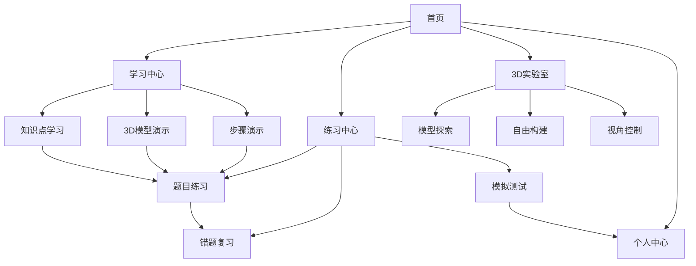

## 1. 产品概述
立体几何教学网页应用是一个专为中学生设计的交互式3D可视化学习平台，旨在通过直观的立体几何模型展示和互动操作，帮助学生克服空间想象力不足的困难，掌握立体几何的核心概念和解题方法。

产品解决的核心问题：中学生空间想象力不足、立体几何概念抽象难懂、传统2D教材无法有效展示3D几何特性。通过3D可视化技术让抽象几何概念具象化，提升学习效率和兴趣。

目标用户：初中至高中学生、数学教师、家长辅导者。市场价值：填补国内立体几何教学工具的空白，提升数学教学效果。

## 2. 核心功能

### 2.1 用户角色
| 角色 | 注册方式 | 核心权限 |
|------|----------|----------|
| 学生用户 | 邮箱/手机号注册 | 学习课程、练习题目、查看学习进度 |
| 教师用户 | 邮箱+教师认证 | 创建班级、布置作业、查看学生进度、使用教学工具 |
| 家长用户 | 邮箱注册 | 查看孩子学习进度、购买课程 |
| 管理员 | 后台创建 | 管理用户、课程、系统设置 |

### 2.2 功能模块
立体几何教学应用包含以下核心页面：
1. **首页**：课程导航、学习进度、推荐内容、个人中心
2. **学习中心**：知识点学习、3D模型展示、步骤演示、互动练习
3. **练习中心**：题目练习、错题集、模拟测试、成绩统计
4. **3D实验室**：自由探索、模型构建、参数调整、视角控制
5. **个人中心**：学习记录、成就系统、设置管理、帮助中心

### 2.3 页面详情
| 页面名称 | 模块名称 | 功能描述 |
|----------|----------|----------|
| 首页 | 导航栏 | 显示logo、搜索框、用户头像、消息通知 |
| 首页 | 课程推荐 | 基于学习进度推荐相关知识点和练习 |
| 首页 | 学习统计 | 显示今日学习时间、完成题目数量、掌握程度 |
| 学习中心 | 知识点列表 | 按教材章节展示立体几何知识点，支持筛选和搜索 |
| 学习中心 | 3D模型展示区 | 360度旋转、缩放、剖面展示、动画演示几何体特性 |
| 学习中心 | 步骤演示区 | 分步骤展示解题过程，支持暂停、重播、调速 |
| 学习中心 | 互动操作区 | 拖拽组装、参数调整、实时反馈操作结果 |
| 练习中心 | 题目练习 | 按难度分级（基础/进阶/挑战），支持多种题型 |
| 练习中心 | 错题集 | 自动收集错题，提供详细解析和类似题目练习 |
| 练习中心 | 模拟测试 | 限时测试、成绩评估、知识点掌握度分析 |
| 3D实验室 | 模型库 | 提供常见几何体模型（棱柱、棱锥、球体等） |
| 3D实验室 | 构建工具 | 自由组合几何体、调整参数、创建自定义模型 |
| 3D实验室 | 视角控制 | 支持多视角切换、剖面图生成、投影展示 |
| 个人中心 | 学习记录 | 展示学习轨迹、知识点掌握情况、学习时间统计 |
| 个人中心 | 成就系统 | 学习里程碑、徽章收集、排行榜功能 |

## 3. 核心流程

### 学生用户学习流程
学生用户进入应用后，可以选择系统推荐的学习路径或自主探索。在学习中心，学生可以观看3D模型演示，通过互动操作加深理解。完成学习后进入练习中心巩固知识，系统会根据答题情况智能推荐相关练习。所有学习数据都会记录在个人中心，方便随时查看学习进度。

### 教师用户教学流程
教师用户可以创建虚拟班级，邀请学生加入。在课堂教学中，教师可以使用3D实验室进行实时演示，通过大屏幕展示立体几何模型的各个角度。课后可以布置针对性作业，系统会自动批改客观题，主观题提供参考答案。教师可以查看班级整体学习情况，识别学生的薄弱环节。

## 4. 用户界面设计

### 4.1 设计风格
- **主色调**：科技蓝（#2196F3）配白色背景，营造专业学习氛围
- **辅助色**：渐变橙（#FF9800）用于强调和交互元素
- **按钮样式**：圆角矩形，悬停效果，主要操作用实心按钮
- **字体选择**：中文使用思源黑体，英文使用Roboto，确保跨平台一致性
- **布局风格**：卡片式布局，清晰的信息层级，充足的留白
- **图标风格**：线性图标，简洁现代，符合教育应用定位

### 4.2 页面设计要点
| 页面名称 | 模块名称 | UI元素 |
|----------|----------|--------|
| 首页 | 导航栏 | 顶部固定，包含logo、搜索框、用户头像，高度64px |
| 首页 | 课程卡片 | 圆角卡片设计，包含课程图标、标题、进度条，悬停放大效果 |
| 学习中心 | 3D展示区 | 占据页面中心，600x400px画布，支持鼠标拖拽旋转 |
| 学习中心 | 控制面板 | 右侧边栏，包含参数滑块、按钮组、视角选择器 |
| 练习中心 | 题目卡片 | 清晰的题目编号，选项按钮，提交按钮固定在底部 |
| 3D实验室 | 工具栏 | 左侧垂直工具栏，包含几何体选择、构建工具、参数调整 |
| 个人中心 | 数据可视化 | 使用图表展示学习进度，支持时间筛选和数据导出 |

### 4.3 响应式设计
- **桌面优先**：主要面向PC端使用，充分利用大屏幕优势展示3D内容
- **平板适配**：支持iPad等平板设备，触摸操作优化
- **移动端简化**：手机端主要提供学习记录查看和简单练习功能
- **触控优化**：支持触摸旋转、双指缩放等手势操作

## 5. 技术实现建议

### 5.1 3D渲染引擎
推荐使用Three.js作为3D渲染引擎，它具有良好的浏览器兼容性和丰富的几何体支持。对于复杂的几何计算，可以考虑使用Cannon.js物理引擎来模拟真实的几何体交互。

### 5.2 前端框架
采用React 18 + TypeScript构建用户界面，利用React的组件化特性可以很好地管理复杂的3D场景状态。状态管理使用Redux Toolkit，确保应用状态的一致性。

### 5.3 后端服务
使用Supabase作为后端服务，它提供了完整的身份认证、数据库和文件存储功能。对于3D模型的存储和传输，可以使用Supabase的存储服务，配合CDN加速提升加载速度。

### 5.4 性能优化
- 3D模型使用glTF格式，文件体积小且加载速度快
- 实现模型懒加载和缓存机制，避免重复下载
- 使用Web Workers处理复杂的几何计算，避免阻塞主线程
- 实施渐进式加载策略，优先显示低精度模型

## 6. 学习路径设计

### 6.1 基础阶段（初中）
从简单的立方体、长方体开始，逐步引入棱柱、棱锥的概念。重点培养空间想象力和基本的几何体认知能力。

### 6.2 进阶阶段（高中基础）
学习圆柱、圆锥、球体等曲面几何体，理解表面积和体积的计算公式。通过3D模型直观展示公式的几何意义。

### 6.3 高级阶段（高中进阶）
掌握复杂几何体的组合、截面分析、投影变换等高级概念。通过交互式操作帮助学生理解抽象的空间几何关系。

### 6.4 智能推荐系统
基于学生的学习进度和答题情况，智能推荐适合的学习内容和练习题目。系统会记录每个知识点的掌握程度，生成个性化的学习路径。

## 7. 辅助功能设计

### 7.1 无障碍支持
- 提供语音讲解功能，支持中文语音播报
- 高对比度模式，照顾视力不佳的学生
- 键盘快捷键支持，方便操作
- 字幕显示，确保听障学生也能使用

### 7.2 学习辅助工具
- 笔记功能：允许学生在学习过程中添加个人笔记
- 收藏功能：收藏重要的知识点和题目
- 分享功能：分享学习成果到社交媒体
- 打印功能：支持打印学习材料和练习题

### 7.3 家长监督功能
- 学习报告：定期向家长发送学习进度报告
- 时间控制：家长可以设置每日学习时间限制
- 内容过滤：根据年龄和学习阶段过滤内容
- 成就通知：及时通知家长孩子的学习成就

这个产品设计充分考虑了中学生的学习特点和立体几何的教学需求，通过3D可视化技术让抽象的几何概念变得直观易懂，同时提供了完整的学习、练习、评估体系，能够有效提升立体几何教学效果。