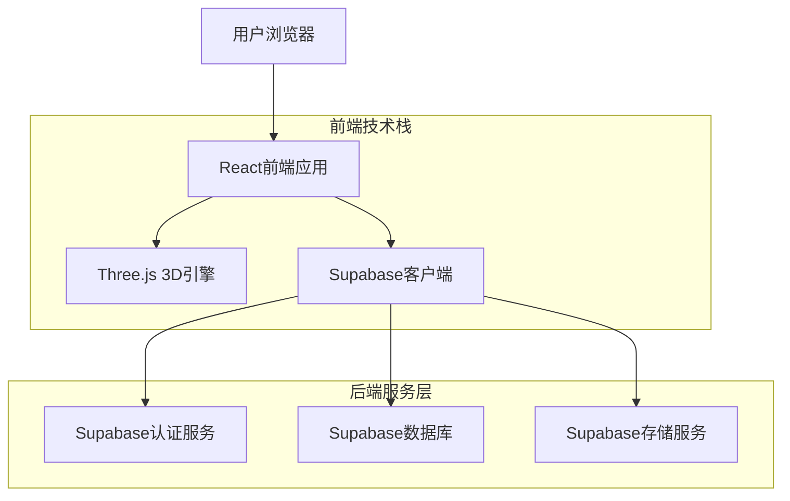

## 1. 架构设计



## 2. 技术描述

- **前端框架**：React 18 + TypeScript + Vite
- **3D渲染**：Three.js + React Three Fiber
- **状态管理**：Redux Toolkit + RTK Query
- **UI组件库**：Ant Design + Tailwind CSS
- **后端服务**：Supabase（认证+数据库+存储）
- **数学计算**：Math.js（几何计算支持）
- **图表可视化**：Chart.js（学习数据统计）

## 3. 路由定义

| 路由路径 | 页面用途 | 权限要求 |
|----------|----------|----------|
| / | 首页，展示学习概览和推荐内容 | 无需登录 |
| /login | 登录页面，支持邮箱和社交登录 | 无需登录 |
| /register | 注册页面，创建新用户账户 | 无需登录 |
| /learn | 学习中心，知识点和3D模型展示 | 需要登录 |
| /learn/:topicId | 具体知识点学习页面 | 需要登录 |
| /practice | 练习中心，题目练习和测试 | 需要登录 |
| /practice/:category | 分类练习页面 | 需要登录 |
| /lab | 3D实验室，自由探索和构建 | 需要登录 |
| /profile | 个人中心，学习记录和设置 | 需要登录 |
| /teacher | 教师控制台，班级和作业管理 | 教师权限 |
| /admin | 管理后台，系统和用户管理 | 管理员权限 |

## 4. 数据模型设计

### 4.1 核心数据模型

```mermaid
erDiagram
    USER ||--o{ LEARNING_PROGRESS : tracks
    USER ||--o{ PRACTICE_RECORD : creates
    USER ||--o{ USER_ACHIEVEMENT : earns
    TOPIC ||--o{ SUBTOPIC : contains
    SUBTOPIC ||--o{ PRACTICE_QUESTION : has
    SUBTOPIC ||--o{ LEARNING_PROGRESS : records
    PRACTICE_QUESTION ||--o{ PRACTICE_RECORD : answers
    USER ||--o{ CLASS_ENROLLMENT : joins
    CLASS ||--o{ CLASS_ENROLLMENT : contains
    TEACHER ||--o{ CLASS : teaches

    USER {
        uuid id PK
        string email UK
        string password_hash
        string username
        string role
        string avatar_url
        timestamp created_at
        timestamp last_login
    }

    TOPIC {
        uuid id PK
        string name
        string description
        integer order_index
        string difficulty_level
        json metadata
    }

    SUBTOPIC {
        uuid id PK
        uuid topic_id FK
        string name
        string description
        integer order_index
        json model_config
        json animation_steps
    }

    PRACTICE_QUESTION {
        uuid id PK
        uuid subtopic_id FK
        string question_type
        string question_text
        json options
        string correct_answer
        json explanation
        integer difficulty
        integer points
    }

    LEARNING_PROGRESS {
        uuid id PK
        uuid user_id FK
        uuid subtopic_id FK
        string status
        integer score
        time spent_time
        timestamp completed_at
    }

    PRACTICE_RECORD {
        uuid id PK
        uuid user_id FK
        uuid question_id FK
        string user_answer
        boolean is_correct
        integer time_spent
        timestamp answered_at
    }
```

### 4.2 数据库表结构

#### 用户表 (users)
```sql
CREATE TABLE users (
    id UUID PRIMARY KEY DEFAULT gen_random_uuid(),
    email VARCHAR(255) UNIQUE NOT NULL,
    password_hash VARCHAR(255) NOT NULL,
    username VARCHAR(100) NOT NULL,
    role VARCHAR(20) DEFAULT 'student' CHECK (role IN ('student', 'teacher', 'parent', 'admin')),
    avatar_url TEXT,
    created_at TIMESTAMP WITH TIME ZONE DEFAULT NOW(),
    updated_at TIMESTAMP WITH TIME ZONE DEFAULT NOW(),
    last_login TIMESTAMP WITH TIME ZONE
);

-- 创建索引
CREATE INDEX idx_users_email ON users(email);
CREATE INDEX idx_users_username ON users(username);
```

#### 知识点表 (topics)
```sql
CREATE TABLE topics (
    id UUID PRIMARY KEY DEFAULT gen_random_uuid(),
    name VARCHAR(200) NOT NULL,
    description TEXT,
    order_index INTEGER NOT NULL,
    difficulty_level VARCHAR(20) CHECK (difficulty_level IN ('beginner', 'intermediate', 'advanced')),
    metadata JSONB DEFAULT '{}',
    created_at TIMESTAMP WITH TIME ZONE DEFAULT NOW()
);
```

#### 子知识点表 (subtopics)
```sql
CREATE TABLE subtopics (
    id UUID PRIMARY KEY DEFAULT gen_random_uuid(),
    topic_id UUID REFERENCES topics(id) ON DELETE CASCADE,
    name VARCHAR(200) NOT NULL,
    description TEXT,
    order_index INTEGER NOT NULL,
    model_config JSONB DEFAULT '{}',
    animation_steps JSONB DEFAULT '[]',
    created_at TIMESTAMP WITH TIME ZONE DEFAULT NOW()
);

CREATE INDEX idx_subtopics_topic_id ON subtopics(topic_id);
```

#### 练习题表 (practice_questions)
```sql
CREATE TABLE practice_questions (
    id UUID PRIMARY KEY DEFAULT gen_random_uuid(),
    subtopic_id UUID REFERENCES subtopics(id) ON DELETE CASCADE,
    question_type VARCHAR(50) NOT NULL CHECK (question_type IN ('multiple_choice', 'true_false', 'fill_blank', 'calculation')),
    question_text TEXT NOT NULL,
    options JSONB DEFAULT '[]',
    correct_answer TEXT NOT NULL,
    explanation TEXT,
    difficulty INTEGER CHECK (difficulty >= 1 AND difficulty <= 5),
    points INTEGER DEFAULT 10,
    created_at TIMESTAMP WITH TIME ZONE DEFAULT NOW()
);

CREATE INDEX idx_practice_questions_subtopic_id ON practice_questions(subtopic_id);
CREATE INDEX idx_practice_questions_difficulty ON practice_questions(difficulty);
```

#### 学习进度表 (learning_progress)
```sql
CREATE TABLE learning_progress (
    id UUID PRIMARY KEY DEFAULT gen_random_uuid(),
    user_id UUID REFERENCES users(id) ON DELETE CASCADE,
    subtopic_id UUID REFERENCES subtopics(id) ON DELETE CASCADE,
    status VARCHAR(20) DEFAULT 'not_started' CHECK (status IN ('not_started', 'in_progress', 'completed', 'mastered')),
    score INTEGER CHECK (score >= 0 AND score <= 100),
    spent_time INTEGER DEFAULT 0, -- 秒为单位
    completed_at TIMESTAMP WITH TIME ZONE,
    created_at TIMESTAMP WITH TIME ZONE DEFAULT NOW(),
    updated_at TIMESTAMP WITH TIME ZONE DEFAULT NOW(),
    UNIQUE(user_id, subtopic_id)
);

CREATE INDEX idx_learning_progress_user_id ON learning_progress(user_id);
CREATE INDEX idx_learning_progress_subtopic_id ON learning_progress(subtopic_id);
```

#### 练习记录表 (practice_records)
```sql
CREATE TABLE practice_records (
    id UUID PRIMARY KEY DEFAULT gen_random_uuid(),
    user_id UUID REFERENCES users(id) ON DELETE CASCADE,
    question_id UUID REFERENCES practice_questions(id) ON DELETE CASCADE,
    user_answer TEXT NOT NULL,
    is_correct BOOLEAN NOT NULL,
    time_spent INTEGER DEFAULT 0, -- 秒为单位
    answered_at TIMESTAMP WITH TIME ZONE DEFAULT NOW()
);

CREATE INDEX idx_practice_records_user_id ON practice_records(user_id);
CREATE INDEX idx_practice_records_question_id ON practice_records(question_id);
CREATE INDEX idx_practice_records_answered_at ON practice_records(answered_at DESC);
```

### 4.3 权限设置
```sql
-- 基本访问权限（匿名用户）
GRANT SELECT ON topics TO anon;
GRANT SELECT ON subtopics TO anon;

-- 认证用户权限
GRANT ALL PRIVILEGES ON users TO authenticated;
GRANT ALL PRIVILEGES ON learning_progress TO authenticated;
GRANT ALL PRIVILEGES ON practice_records TO authenticated;
GRANT SELECT ON practice_questions TO authenticated;

-- 教师权限
GRANT ALL PRIVILEGES ON topics TO authenticated;
GRANT ALL PRIVILEGES ON subtopics TO authenticated;
GRANT ALL PRIVILEGES ON practice_questions TO authenticated;
```

## 5. 核心API设计

### 5.1 认证相关API

#### 用户注册
```
POST /api/auth/register
```

请求参数：
| 参数名 | 类型 | 必需 | 描述 |
|--------|------|------|------|
| email | string | 是 | 用户邮箱 |
| password | string | 是 | 用户密码（最少8位） |
| username | string | 是 | 用户名 |
| role | string | 否 | 用户角色，默认student |

响应示例：
```json
{
  "user": {
    "id": "uuid",
    "email": "student@example.com",
    "username": "张三",
    "role": "student"
  },
  "session": {
    "access_token": "jwt_token",
    "refresh_token": "refresh_token"
  }
}
```

#### 用户登录
```
POST /api/auth/login
```

### 5.2 学习进度API

#### 获取学习进度
```
GET /api/learning/progress
```

响应示例：
```json
{
  "progress": [
    {
      "topic_id": "uuid",
      "topic_name": "基础几何体",
      "completion_rate": 75,
      "subtopics": [
        {
          "subtopic_id": "uuid",
          "name": "立方体认知",
          "status": "completed",
          "score": 90,
          "spent_time": 1800
        }
      ]
    }
  ]
}
```

#### 更新学习进度
```
POST /api/learning/progress/{subtopic_id}
```

### 5.3 练习相关API

#### 获取练习题
```
GET /api/practice/questions?subtopic_id={id}&difficulty={level}
```

#### 提交练习答案
```
POST /api/practice/submit
```

请求参数：
| 参数名 | 类型 | 必需 | 描述 |
|--------|------|------|------|
| question_id | string | 是 | 题目ID |
| user_answer | string | 是 | 用户答案 |
| time_spent | integer | 是 | 答题用时（秒） |

响应示例：
```json
{
  "result": {
    "is_correct": true,
    "correct_answer": "A",
    "explanation": "立方体有6个面，每个面都是正方形...",
    "score": 10,
    "new_progress": 85
  }
}
```

## 6. 3D模型管理

### 6.1 模型文件结构
```
/models/
├── basic/                    # 基础几何体
│   ├── cube.gltf            # 立方体
│   ├── rectangular_prism.gltf  # 长方体
│   ├── cylinder.gltf        # 圆柱体
│   └── sphere.gltf          # 球体
├── advanced/                 # 复杂几何体
│   ├── pyramid.gltf         # 棱锥
│   ├── prism.gltf           # 棱柱
│   └── cone.gltf            # 圆锥
└── animations/              # 动画文件
    ├── cube_rotation.gltf   # 旋转动画
    └── cross_section.gltf   # 截面动画
```

### 6.2 模型加载优化
- 使用glTF格式，文件体积小，加载速度快
- 实施LOD（Level of Detail）策略，根据距离显示不同精度模型
- 使用纹理压缩技术，减少GPU内存占用
- 实现模型预加载和缓存机制

## 7. 性能优化策略

### 7.1 前端优化
- **代码分割**：按路由和组件进行代码分割，减少首屏加载时间
- **懒加载**：3D模型和大型资源使用懒加载策略
- **缓存策略**：合理使用浏览器缓存和Service Worker
- **虚拟滚动**：长列表使用虚拟滚动技术

### 7.2 3D渲染优化
- **几何体简化**：减少不必要的顶点和面数
- **纹理优化**：使用适当分辨率的纹理，避免过度细节
- **渲染批次合并**：减少draw call数量
- **遮挡剔除**：不渲染被遮挡的几何体

### 7.3 网络优化
- **CDN加速**：静态资源使用CDN分发
- **压缩传输**：启用Gzip压缩，减少传输数据量
- **图片优化**：使用WebP格式，提供多种尺寸适配
- **预加载策略**：关键资源提前预加载

## 8. 安全考虑

### 8.1 数据安全
- 用户密码使用bcrypt加密存储
- 敏感API需要JWT认证
- 数据库连接使用SSL加密
- 定期数据备份和恢复测试

### 8.2 内容安全
- 用户上传内容需要审核
- 防止XSS攻击，对用户输入进行过滤
- 实施CSRF保护机制
- 限制API请求频率，防止滥用

### 8.3 隐私保护
- 遵循GDPR和相关隐私法规
- 用户数据最小化收集原则
- 提供数据导出和删除功能
- 透明的隐私政策和用户协议

这个技术架构设计充分考虑了立体几何教学应用的特殊需求，通过现代化的技术栈实现了高性能的3D渲染和良好的用户体验，同时保证了系统的可扩展性和安全性。